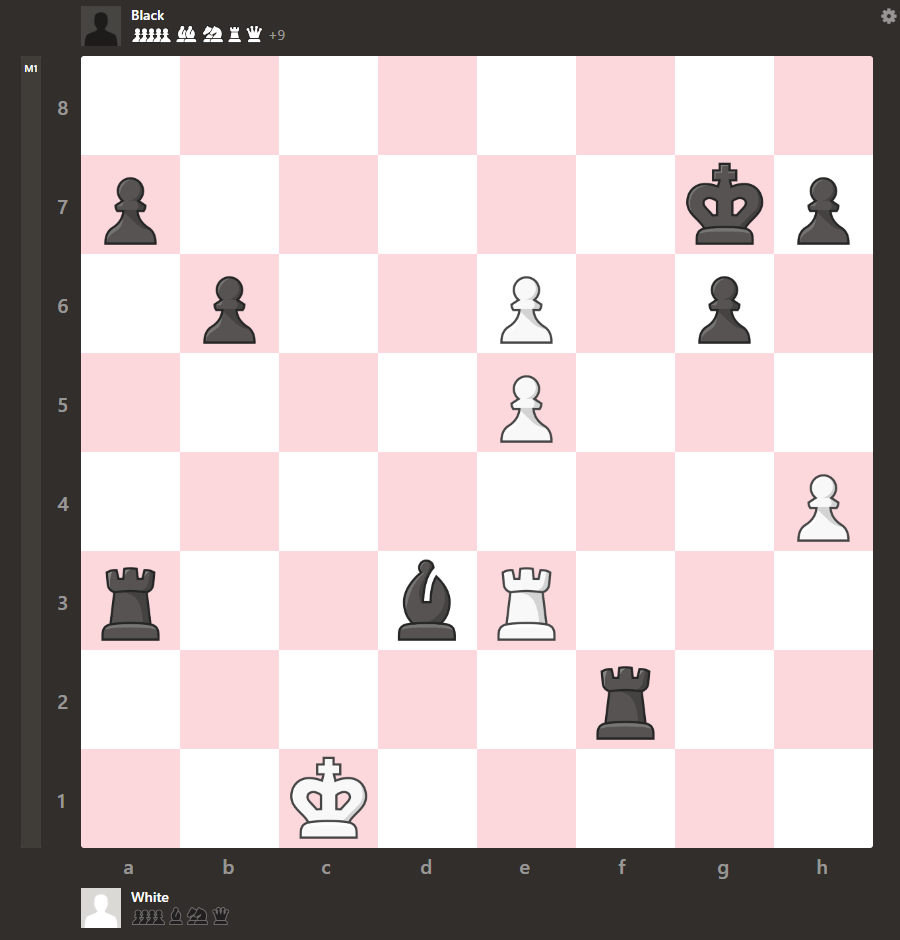

# Machine learning / Surrogate Modelling approximation of Chess Evaluation

The idea behind this project is that Chess is very positional. Passed pawns, bad / central king placement and open / closed positions are all important parameters in determining whether a position is winning or losing.
A convolutional neural network may excel here, as convolution kernels could take into account surrounding pieces and localisation of kings relative to opposition's powerful or weak pieces.

This small project aims to extract a small amount of interesting features from self-generated chess positions, evaluate them and train a network to approximate the values.

# Chess Position Generation and Evaluation
Feature Extraction.py relies on the Stockfish chess engine, which can be downloaded [here](https://stockfishchess.org/download/), and the python-chess module.

A chess position can be either generated using the Stockfish engine or specified using [Forsyth-Edwards Notation (FEN) codes](https://en.wikipedia.org/wiki/Forsyth%E2%80%93Edwards_Notation).
Generation of a position uses the Stockfish engine against itself at random, so likely different, 'skill' levels such that an interesting and randomly evaluated position is reached. (Always setting to a similar level would mean all evaluations are approximately 0.0).
Similar online tools that are much faster randomise the FEN or play random legal moves, but these head mostly nonsense positions which are extremely unlikely to be reached in a real game.

Evaluation is also done with the Stockfish engine and gives the pawn advantage score relative to white as a float.
```python
evaluate_fen("rnbqkbnr/pppp1ppp/8/4N3/8/8/PPPPPPPP/RNBQKB1R b KQkq - 0 2")
> 1.17
```
The following code can be used to generate a more inbalanced endgame by specifying a large skill difference and a large number of moves.
The function will break at checkmate or draw, if the target moves have not been reached, and remove the last move such that the position can still be effectively evaluated.
```python
fen = generate_fen(time_per_move=0.01, p1_skill=5, p2_skill=18, moves=100)
```


# Piece and King Strength and Localisation
The first two dimensions in the feature extraction represent the position of pieces as extracted from the FEN.
To spare dimensionality but differentiate between colour each 8x8x1 array slice starts as a 50% gray plane and is populated with lighter or darker values for white or black pieces respectively.
The pieces are distributed from 255/2 -> 255 or 0 -> 255 respective to their points values in Chess.
Bishops however are rated marginally higher as this differentiates them from knights and illustates their slight advantage (though controversial).
Kings are rated only slightly higher than pawns to demonstrate their positional strength in dimension 1 and their localisations are also placed, alone, into the second dimension in this array.

## Pawn progression
As pawns approaching the final rank are far more dangerous than further back pawns, a function is used to increase the value of the pawn towards a queen exponentially as it starts to reach this final rank. As such this is only very apparent when a pawn is passed and has been able to breach rank 7.

An exponential function was created to describe this:

$$\LARGE y = \frac{1}{2}e^{\frac{(x-5)}{0.725}}+1$$

With x values in the range:
$$0 \geq x \geq 7$$


